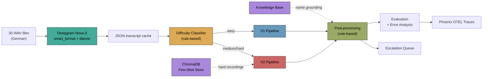
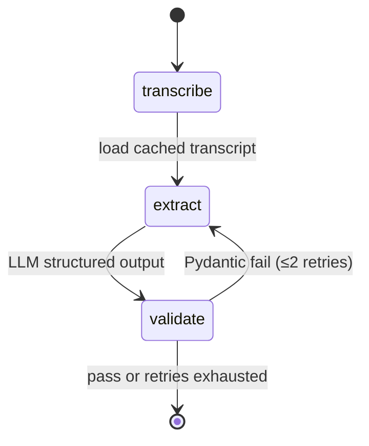
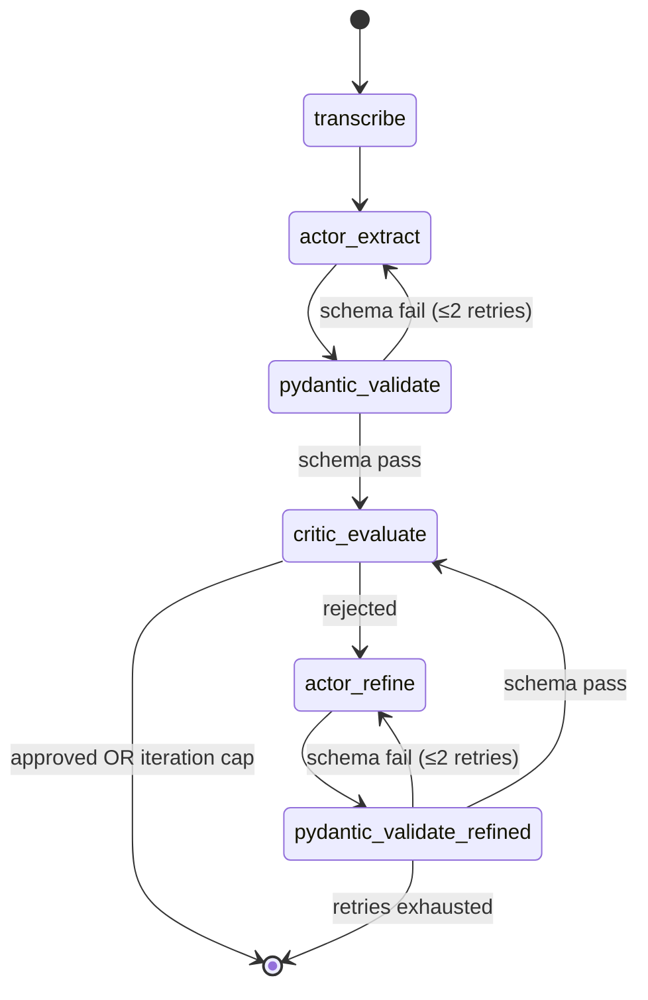

# Phonebot AI Engineer Technical Challenge

## Overview

This is a technical challenge for the Phonebot AI Engineer candidates. You will build a post-processing pipeline that extracts caller information from AI phone bot recordings.

## Business Problem

Our AI phone bots conduct conversations with callers to collect contact information. After each call, we need to extract structured data from the recordings for downstream processing (updating the cases, CRM, follow-ups, etc.).

Your task is to build a pipeline that processes audio recordings and extracts the following entities:
- **first_name**: Caller's first name
- **last_name**: Caller's last name
- **email**: Caller's email address
- **phone_number**: Caller's phone number

## Technical Challenge

Build a system that:
1. Processes the provided audio recordings
2. Extracts the four entity types listed above
3. Outputs results in a format that can be compared against the ground truth

### Requirements
- Maximize accuracy against the provided ground truth
- Follow best practices for AI/ML pipelines
- Consider production readiness in your design

## Evaluation Criteria

We evaluate submissions based on the following criteria:

### 1. Accuracy
How well does your system perform against the ground truth? We'll measure:
- Per-entity accuracy (first_name, last_name, email, phone_number)
- Overall extraction accuracy
- Handling of edge cases (special characters, international names, etc.)

### 2. AI Engineering Approach
- **Transcription**: Model choice and configuration
- **Prompting Strategy**: How you structure prompts for extraction
- **Error Handling**: Graceful degradation, retry logic, fallbacks

### 3. Future-proofing & Controllability
- **Monitoring**: How would you track system performance?
- **Observability**: Logging, tracing, debugging capabilities
- **Prompt Management**: Easy updates without code changes
- **A/B Testing**: Ability to compare different approaches

### 4. Code Quality
- Clean, readable, and maintainable code
- Appropriate documentation
- Good project structure
- Test coverage where appropriate

## Sample Data

The `data/` directory contains:
- `recordings/`: 30 WAV audio files (call_01.wav through call_30.wav)
- `ground_truth.json`: Expected extraction results for each recording

### Ground Truth Format

```json
{
  "recordings": [
    {
      "id": "call_01",
      "file": "call_01.wav",
      "expected": {
        "first_name": "Jürgen",
        "last_name": "Meyer",
        "email": "j.meyer@gmail.com",
        "phone_number": "+4917284492"
      }
    }
  ]
}
```

**Note**: Some entities may have multiple acceptable values (stored as arrays), e.g., `"first_name": ["Lisa Marie", "Lisa-Marie"]`. Your extraction is considered correct if it matches any of the acceptable values.

## Important Notes

- **Language**: All recordings are in German, but German language proficiency is NOT required for this challenge. The focus is on your engineering approach, not language skills.
- **Time**: There is no strict time limit, but we expect a reasonable solution within a few days.
- **Resources**: You may use any tools, libraries, or APIs you see fit.

## Discussion Questions

Be prepared to discuss the following during the technical interview:

1. **Production Monitoring**: How would you monitor and improve the system in production?

2. **Extensibility**: How would you handle new entity types (e.g., address, company name)?

3. **System Health**: What metrics would you track to measure system health?

## Delivery Format

Please prepare:
1. **Working Code/Prototype**: A functional implementation that processes the recordings
2. **Brief Documentation**: How to run your solution and any design decisions
3. **1-Hour Technical Discussion**: We'll review your solution together and discuss the questions above

## Getting Started

1. Review the sample recordings and ground truth
2. Design your extraction pipeline
3. Implement and test your solution
4. Document your approach and any trade-offs made

Good luck!

---

## Solution Architecture

### Quick Start

```bash
uv sync                                                          # install deps
cp .env.example .env                                             # add DEEPGRAM_API_KEY + ANTHROPIC_API_KEY
uv run python run.py                                             # v1 pipeline, default model
uv run python run.py --pipeline v1 --prompt-version v2           # v1 pipeline + GEPA-optimized prompt
uv run python run.py --pipeline v2 --prompt-version v2_ac        # v2 actor-critic + GEPA-optimized prompt
uv run python compare.py                                         # A/B comparison across all result files
uv run python optimize.py --pipeline v2 --max-calls 150          # GEPA prompt optimization
uv run python run.py --final                                     # canonical submission (best config)
```

### System Overview



### V1 Pipeline — Simple Extract

Fastest path. Single LLM call with Pydantic validation and retry.



### V2 Pipeline — Actor-Critic

Adds a critic LLM that cross-checks each field against the transcript, catching semantic errors (wrong name, miscounted digits) that schema validation misses.



The critic returns structured `CriticOutput` with per-field verdicts (`correct`/`needs_fix` + evidence quotes), which the actor uses to refine only the broken fields while anchoring to correct ones.

### Component Choices and Rationale

| Component | Choice | Why |
|-----------|--------|-----|
| **Transcription** | Deepgram Nova-3 (German, `smart_format`, `diarize`) | Best WER for German; diarization separates bot from caller. German `smart_format` does NOT assemble emails or phone digits — the LLM must reconstruct them from spoken components (`Punkt`=`.`, `at`=`@`, digit sequences). |
| **Extraction LLM** | Claude Sonnet 4.6 via `with_structured_output` | Reliable JSON schema conformance, strong German comprehension. Structured output eliminates parsing failures. |
| **Pipeline framework** | LangGraph state machines | Explicit graph topology makes retry/critic loops debuggable. Each node is independently testable. State is a TypedDict — no framework lock-in. |
| **Prompt management** | Externalized JSON (`extraction_v1.json`, `v2.json`, `v2_ac.json`) | Hot-swappable at runtime. GEPA optimizer writes new prompt files without code changes. 5-slot optimization surface: `system_prompt` + 4 field descriptions. |
| **Post-processing** | Rule-based (no LLM): E.164 normalization, Unicode NFC, email lowercase, fuzzy name grounding via `rapidfuzz` | Zero latency, deterministic. Catches formatting inconsistencies the LLM introduces. Name dictionary grounding adjusts confidence when names don't match known German/international entries. |
| **Observability** | Arize Phoenix (OTEL), structlog, custom cost/latency monitors | Auto-instruments every LangChain call. Persistent SQLite storage. Every run is traceable end-to-end. |
| **Optimization** | GEPA (Guided Evolutionary Prompt Adaptation) | Offline prompt evolution with LLM-guided reflection. Treats prompts as 5-slot candidates, scores with weighted per-field accuracy, and uses a reflection LM (Claude Opus 4.6) to propose improvements based on failure analysis. |
| **Knowledge base** | German name dictionary (`data/knowledge/german_names.json`) + `rapidfuzz` | Fuzzy name grounding adjusts confidence scores post-extraction. Threshold 75 similarity — ungrounded names get a 0.15 confidence penalty and are flagged for review. Not a correction layer — never overrides the LLM's extraction. |
| **Few-shot RAG** | ChromaDB (embedded, cosine similarity) | Indexes all 30 transcript→ground_truth pairs. At extraction time, retrieves k=2 most similar solved examples for hard recordings. Injected as few-shot context into the LLM prompt. Highest-impact component for foreign names (e.g., "García" transcribed as "Gassia"). |
| **Difficulty classifier** | Rule-based scorer (zero LLM cost) | Scores transcripts on 7 signals: length, speakers, email/phone markers, foreign name indicators, spelling detection, Deepgram confidence. Routes EASY (0-3) → V1, MEDIUM (4-6) → V2 with 1 iteration, HARD (7+) → V2 with 3 iterations + few-shot RAG. |

### Knowledge Layer & Few-Shot RAG

The pipeline includes a knowledge grounding layer that operates at two stages:

**Pre-extraction (few-shot RAG):** For recordings classified as HARD by the difficulty classifier, ChromaDB retrieves the 2 most similar solved transcripts from the ground truth index. These are formatted as few-shot examples and prepended to the LLM prompt, giving the model concrete examples of how similar spoken-form transcripts map to structured output. Enabled via `--few-shot` flag.

**Post-extraction (knowledge grounding):** After the LLM produces its extraction, rule-based modules validate and adjust confidence:

1. **Name grounding** (`name_lookup.py`): Fuzzy-matches extracted names against a curated German/international name dictionary using `rapidfuzz`. Names below threshold 75 get a confidence penalty (0.15) and are flagged — but never overridden.
2. **Contact pattern validation** (`contact_patterns.py`): Validates phone numbers against German patterns via `phonenumbers` library (prefix, length, E.164 format). Validates email format and checks domain against known providers (gmail.com, web.de, t-online.de, etc.). Invalid patterns incur confidence penalties (0.25 phone, 0.20 email, 0.10 unknown domain).
3. **Cross-reference check**: Verifies that the extracted name appears in the email local part where expected (e.g., `johanna.schmidt` in the email matches first_name=Johanna, last_name=Schmidt).

These grounding signals feed into the escalation decision: recordings with overall confidence < 0.5 or >2 flagged fields are routed to a human review queue (`outputs/escalation_queue.json`).

### Accuracy Results

All runs use Claude Sonnet 4.6 on 30 recordings. Post-processing enabled.

| Pipeline | Prompt | first_name | last_name | email | phone_number | **Overall** | Avg Latency | Errors |
|----------|--------|-----------|-----------|-------|-------------|-------------|-------------|--------|
| V1 | v1 (baseline) | 90% | 77% | 67% | 100% | **83%** | 2.3s/rec | 20 |
| V2 (actor-critic) | v1 | 93% | 80% | 77% | 100% | **88%** | 3.9s/rec | 15 |
| V2 (actor-critic) | v2_ac (GEPA) | 93% | 80% | 83% | 100% | **89%** | 3.3s/rec | 13 |
| V1 | v2 (GEPA) | 97% | 87% | 90% | 100% | **93%** | 2.3s/rec | 8 |

The V1+v2 prompt combination achieves the highest accuracy (93%) because GEPA's v1-pipeline optimization ran for more iterations (51 vs. the v2 pipeline's constrained budget) and the v2 prompt contains substantially more detailed extraction rules. The v2 actor-critic pipeline with v2_ac prompt (89%) trades some accuracy for semantic verification — useful in production where false positives are costly.

### What the actor-critic fixes

The diff table from `compare.py` shows exactly where V2 corrects V1's mistakes:

| Recording | Field | V1 (wrong) | V2 (correct) | Root Cause |
|-----------|-------|------------|--------------|------------|
| call_07 | email | julia.schr**0**der@web.de | julia.schroeder@web.de | Digit/letter confusion in local part |
| call_17 | email | s**0**phie.dub**0**is@outlook.fr | sophie.dubois@outlook.fr | Same — "o" misread as "0" |
| call_22 | email | lucas.silva@u**0**l.com.br | lucas.silva@uol.com.br | Domain letter/digit confusion |
| call_24 | last_name | Xen | Chen | Phonetic mismatch caught by critic |
| call_26 | first_name | Armet | Ahmed | Phonetic mismatch caught by critic |
| call_30 | email | liam.**0**brien@gmail.com | liam.obrien@gmail.com | Digit/letter confusion |

The critic consistently catches two error classes: **letter/digit confusion** in emails (o→0) and **phonetic mismatches** in international names. These are semantic errors invisible to Pydantic validation.

### Remaining errors

The 13 remaining errors in the best V2 run are dominated by:
- **NAME_SPELLING_VARIANT** (8): Kowalsky/Kowalski, Anderson/Andersson, Martinez/Martínez — inherent transcription ambiguity where Deepgram's phonetic output is plausible but non-canonical.
- **EMAIL_ASSEMBLY_ERROR** (5): Cascading from name variants (kowalsky→kowalski in email local part) or spoken-form ambiguity.

These are at the Deepgram transcription boundary — improving them requires either a different ASR model or post-hoc name normalization against an authoritative directory.

### GEPA Prompt Optimization

GEPA treats prompts as evolvable artifacts with 5 optimization slots:

```
┌─────────────────────────────────────────────────┐
│  system_prompt    (extraction instructions)      │
│  first_name       (field description)            │
│  last_name        (field description)            │
│  email            (field description)            │
│  phone_number     (field description)            │
└─────────────────────────────────────────────────┘
```

**Workflow:** Seed candidate (v1 prompt) → evaluate on 20 training recordings → reflection LM analyzes failures and proposes improvements → GEPA evolves candidates on a Pareto frontier → validate on held-out 10 recordings.

**Field weighting:** Inverse-accuracy weighting (`weight = max(1 - baseline_accuracy, 0.05)`) focuses optimization budget on the weakest fields. With v1 baseline, email gets 47% of the optimization weight, last_name 33%, first_name 14%, phone_number 7%.

**Results:**

| Optimization Target | Duration | Iterations | Val Delta | Key Improvement |
|---------------------|----------|------------|-----------|-----------------|
| V1 pipeline prompts | 7 min | 51 | +2.5% | last_name +10% |
| V2 pipeline prompts | 84s | 1 (resumed) | 0% | At ceiling (91% train) |

The V2 pipeline optimization shows diminishing returns — the actor-critic loop already handles most extractable errors, leaving the prompt optimizer little room to improve. The V1 optimization was more productive because the simpler pipeline has more headroom for prompt-driven gains.

### Observability with Phoenix

Every pipeline run produces OTEL traces viewable at `http://localhost:6006/`:

- **Per-recording traces**: Full LLM call chain — transcribe → extract → validate → (critic → refine)* → postprocess
- **Token usage & latency**: Per-call input/output tokens, wall-clock time
- **Retry context**: Why validation failed, what error context was injected
- **Critic feedback**: Per-field verdicts and evidence quotes (V2 only)
- **GEPA iterations**: Tagged with `gepa_opt_{n}` for prompt A/B tracing

Phoenix persists to `.phoenix/phoenix.db` (SQLite). To investigate a specific recording's extraction, filter by `session.id` containing the recording ID, then drill into individual LLM spans to see the exact prompt/response. The prompt registry (`outputs/prompt_registry.json`) maps content hashes to accuracy metrics, solving "which prompt produced 84%?".

Additional observability: structured JSON logs (structlog), per-node latency percentiles (p50/p95/p99 with 30s SLA budget), cost tracking per model, regression detection against saved baselines, and an escalation queue for recordings where confidence < 0.5 or >2 fields are flagged.

### Tradeoffs

| Decision | Tradeoff |
|----------|----------|
| **Deepgram over Whisper** | Better German WER and managed API, but introduces vendor dependency and per-minute cost. Transcripts are cached to avoid repeat charges. |
| **Claude over local models** | Higher accuracy but higher latency/cost per call. Ollama (llama3.2:3b) was tested at 0% accuracy — not viable for this domain. |
| **Actor-critic (V2) vs single-pass (V1)** | 2-3x more LLM calls per recording, ~60% higher latency. Justified when false positives are costly; overkill for high-confidence recordings. The orchestrator (not used in these benchmarks) routes easy calls to V1 and hard calls to V2 based on a rule-based classifier. |
| **Externalized prompts over code** | Adds a file I/O layer but enables GEPA optimization, prompt versioning, and A/B testing without code changes or redeployment. |
| **Rule-based post-processing over LLM** | Zero latency and deterministic, but can't fix semantic errors. Handles normalization (E.164, Unicode NFC, email casing) perfectly; leaves semantic correction to the critic. |
| **GEPA over manual prompt tuning** | Systematic but expensive (~$5-10 per run). Reflection LM (Opus) costs more than the extraction LM (Sonnet). Worth it for offline optimization; wouldn't run in production. |

### Discussion Answers

**1. Production Monitoring**

The system already implements a monitoring stack: Phoenix OTEL tracing for per-call visibility, structured logging for event-level audit, latency monitoring with SLA budgets (30s/recording, p95 tracked), cost tracking per model, and regression detection against saved accuracy baselines. An alert system fires on: overall accuracy <80%, per-field regressions, escalation rate >20%, or latency SLA violations. In production, I'd add: (a) a metrics exporter to Prometheus/Datadog for dashboarding, (b) periodic re-evaluation against a growing labeled set, (c) drift detection on Deepgram transcription confidence scores, and (d) A/B traffic splitting between prompt versions via the existing prompt registry.

**2. Extensibility**

Adding a new entity (e.g., `address`, `company_name`) requires: (1) add the field to the prompt JSON's `fields` dict — the `build_caller_info_model()` factory dynamically constructs the Pydantic model from whatever fields are present; (2) add a normalization rule in `postprocess.py` if needed; (3) add the field to `FIELDS` in `metrics.py` and extend ground truth. No pipeline code changes — the LangGraph topology, critic, and GEPA optimizer all operate on the CallerInfo model generically. The few-shot retrieval and difficulty classifier would benefit from new signal functions but work without them.

**3. System Health Metrics**

Currently tracked: per-field and overall accuracy (with history in JSONL), per-recording latency percentiles, LLM cost per run, escalation rate, error type distribution (8 categories), prompt content hash → accuracy mapping, and regression delta against baseline. The key production health signals would be: (a) accuracy trend over time (catch model degradation), (b) escalation rate (proxy for confidence), (c) p95 latency (catch API slowdowns), (d) cost per recording (catch prompt bloat), and (e) Deepgram transcript confidence distribution (catch audio quality issues upstream).
